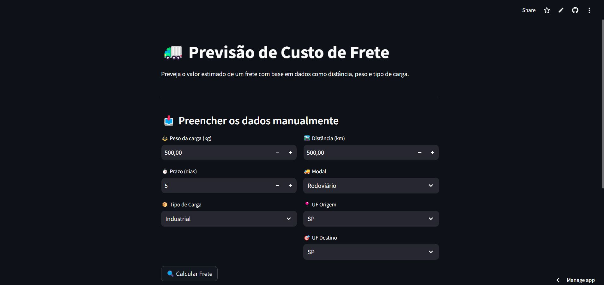

# 📦 Previsão de Custos de Frete com Machine Learning


Aplicação interativa para **previsão de custos de frete** utilizando **Machine Learning** (Random Forest).  
O modelo foi treinado com dados históricos e ajustado com **GridSearchCV** para entregar previsões mais precisas.

🔗 **[Acesse o App Online](https://frete-previsao-fz2s5ocwoc97y6ggf2bm2m.streamlit.app/)**

---

## 🚀 Funcionalidades

- Upload de arquivo Excel/CSV com dados do frete
- Previsão de custos com base em variáveis logísticas
- Ajuste automático de parâmetros do modelo
- Visualização interativa dos resultados
- Download do resultado previsto

---

## 🛠️ Tecnologias Utilizadas

- **Python** (pandas, numpy, scikit-learn)
- **Streamlit** (frontend interativo)
- **Matplotlib** (visualização de dados)
- **Joblib** (armazenamento do modelo)
- **GridSearchCV** (otimização de hiperparâmetros)

---

## 📸 Demonstração



---

## 📂 Estrutura do Projeto

```
frete-previsao/ 
├── data/ # Arquivos de dados
├── images/ # Imagens para o README/app
├── src/ # Código-fonte da aplicação e scripts
├── app.py # Código principal do Streamlit
├── modelo_random_forest_tunado.pkl # Modelo treinado salvo
├── requirements.txt # Dependências do projeto
└── README.md
```

---

## ⚡ Como Executar Localmente

```
# 1. Clonar repositório
git clone https://github.com/LeonardCoelho/frete-previsao.git
cd frete-previsao

# 2. Criar ambiente virtual
python -m venv .venv
source .venv/bin/activate  # Linux/Mac
.venv\Scripts\activate     # Windows

# 3. Instalar dependências
pip install -r requirements.txt

# 4. Rodar o app
streamlit run app.py
```

📌 Autor
Léo Souza — Analista de Transportes & Estudante de Ciência de Dados
💼 LinkedIn | 💻 Portfólio no GitHub
